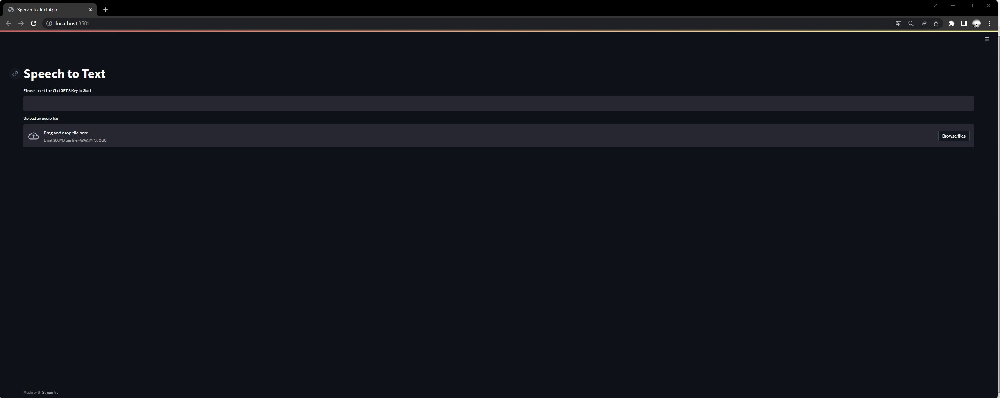
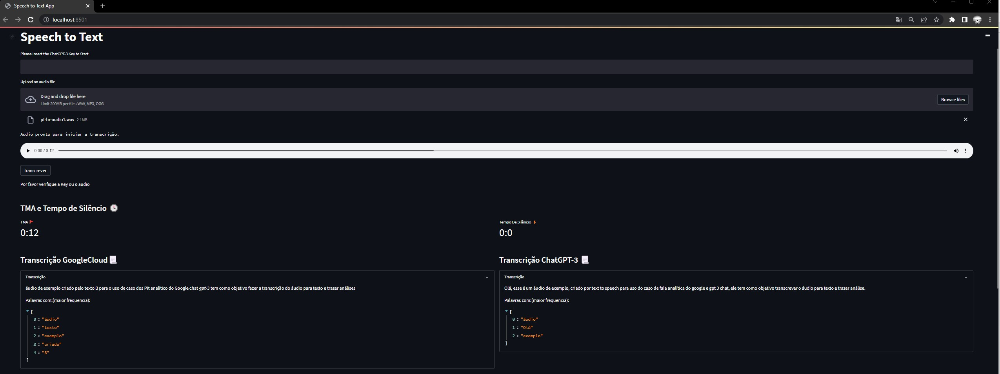
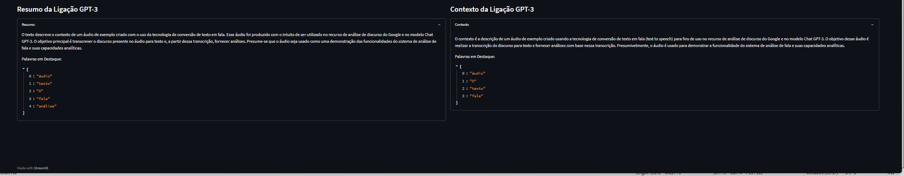

# Streamlit App Speech Recognition using GPT4 and GOOGLE STT.
 
This repository is to share a Application Streamlit to Speech-To-text using ChatGPT-4 and Google STT.   

### Instructions:  
this app run well on python 3.9 or later. 
you need a streamlit installet on your machine or enviroment. 

### Dependencies:  
Please make sure you have python and streamlit installed on your machine 
Also you will need a API KEY from Open AI. 
to run you can open a Terminal CMD and run the following commands: 

### Commands:
pip install -r requirements 
Python pre_requirements_nltk.py - This will install all the dependencies from NLTK   
to run application: 
streamlit run demo_streamlit_speech_recognition.py 

### Applications Screens: 

Screem 1: Sample of Application running!    
 

Screem 2: Sample of Application Results!   

  
 
 ### For more Content about Streamlit please contact me or see my channel:
- Youtube Channel: https://www.youtube.com/@devwithdigas  
- Site: www.devwithdigas.com.br  
